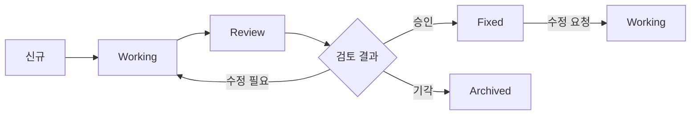

# 📊 컴포넌트 상태 관리

## 🎨 컴포넌트 현황

### 🔴 Fixed (확정됨 - 수정 금지)

| 컴포넌트 | 버전 | 확정일 | 위치 | 설명                      |
| -------- | ---- | ------ | ---- | ------------------------- |
| -        | -    | -      | -    | 아직 확정된 컴포넌트 없음 |

### 🟡 Working (작업 중)

| 컴포넌트 | 작업자 | 시작일 | 위치 | 진행률 | 설명                         |
| -------- | ------ | ------ | ---- | ------ | ---------------------------- |
| -        | -      | -      | -    | -      | 현재 작업 중인 컴포넌트 없음 |

### 🟢 Review (검토 중)

| 컴포넌트 | 제출일 | 검토자 | 위치 | 상태 | 피드백                  |
| -------- | ------ | ------ | ---- | ---- | ----------------------- |
| -        | -      | -      | -    | -    | 검토 대기 컴포넌트 없음 |

### 🔵 Archived (보관)

| 컴포넌트 | 보관일 | 사유 | 백업 위치            |
| -------- | ------ | ---- | -------------------- |
| -        | -      | -    | 보관된 컴포넌트 없음 |

---

## 📝 상태 변경 이력

### 2025년 1월

```markdown
- 2025.01.18: 프로젝트 초기 설정
- 컴포넌트 상태 관리 시스템 구축
```

---

## 🔄 워크플로우



---

## 📋 체크리스트

### 컴포넌트 작업 시작 전

- [ ] 기존 Fixed 컴포넌트 확인
- [ ] Working 폴더에 복사
- [ ] 백업 생성
- [ ] 이 문서 업데이트

### 컴포넌트 검토 제출 전

- [ ] 테스트 완료
- [ ] 스타일 가이드 준수
- [ ] 접근성 체크
- [ ] 반응형 확인
- [ ] 문서화 완료

### 컴포넌트 확정 전

- [ ] 사용자 최종 승인
- [ ] Fix 폴더에 복사
- [ ] FIXED_LIST.md 업데이트
- [ ] 마일스톤 백업

---

## 🏷️ 컴포넌트 태그

### 우선순위

- 🔥 `긴급` - 즉시 작업 필요
- ⚡ `높음` - 우선 작업
- 🔸 `보통` - 일반 작업
- 🔹 `낮음` - 여유시 작업

### 타입

- 📄 `페이지` - 전체 페이지 컴포넌트
- 🧩 `UI` - UI 컴포넌트
- 🎯 `기능` - 기능성 컴포넌트
- 🎨 `스타일` - 스타일 전용
- 📱 `반응형` - 반응형 특화

### 상태

- ✅ `완료` - 작업 완료
- 🔄 `진행중` - 작업 진행 중
- ⏸️ `대기` - 작업 대기
- ❌ `중단` - 작업 중단
- 🐛 `버그` - 버그 수정 필요

---

## 📊 통계

### 전체 현황

```
총 컴포넌트: 0
├── Fixed: 0 (0%)
├── Working: 0 (0%)
├── Review: 0 (0%)
└── Archived: 0 (0%)
```

### 이번 주 활동

```
신규 생성: 0
수정: 0
확정: 0
보관: 0
```

---

## 🔍 빠른 참조

### 폴더 구조

```
src/components/
├── working/        # 작업 중
├── [일반 컴포넌트] # 검토/사용 중
fix/components/     # 확정 (수정 금지!)
backups/component/  # 백업
```

### 명령어

```bash
# 컴포넌트 백업
npm run backup:component [컴포넌트명]

# 상태 확인
npm run status:components

# 검토 제출
npm run submit:review [컴포넌트명]
```

---

## ⚠️ 주의사항

1. **Fixed 컴포넌트는 절대 직접 수정 금지**
2. **모든 작업은 Working 폴더에서 시작**
3. **백업 없이 작업 금지**
4. **상태 변경 시 이 문서 업데이트 필수**

---

_최종 업데이트: 2025년 1월 18일_
_다음 검토: 2025년 1월 25일_
