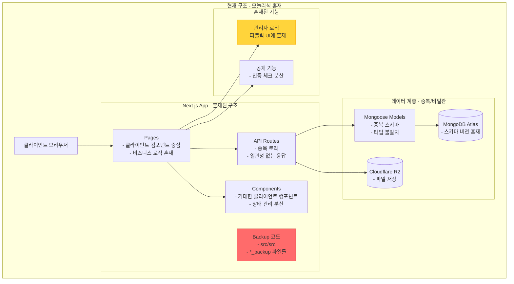
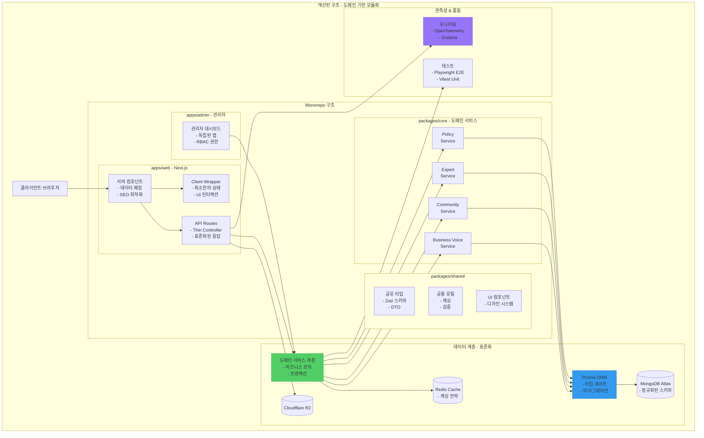
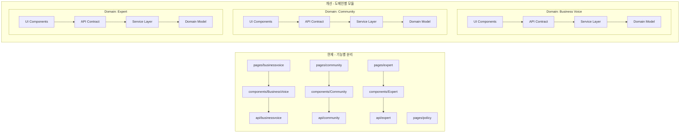
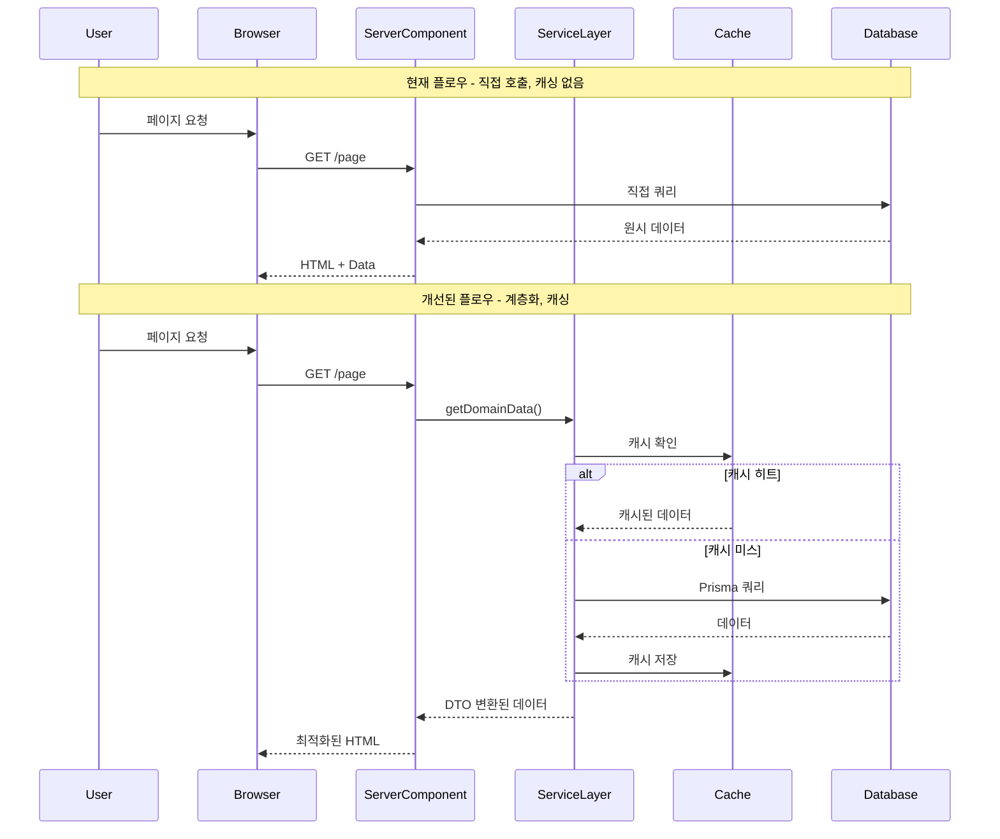
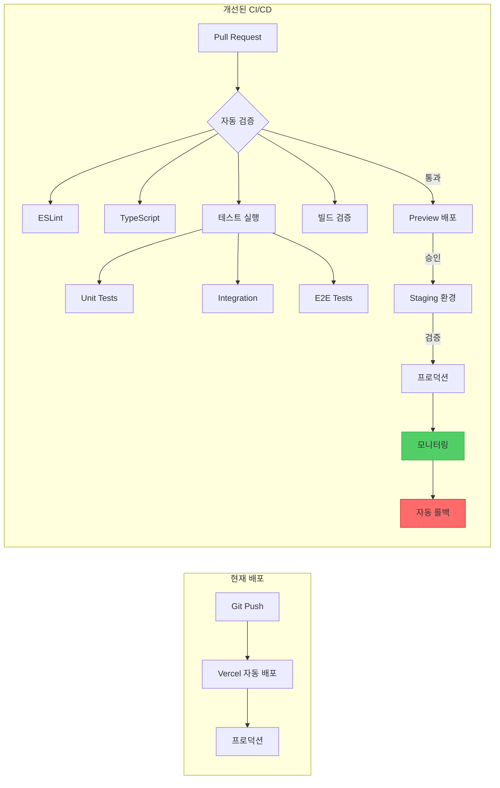
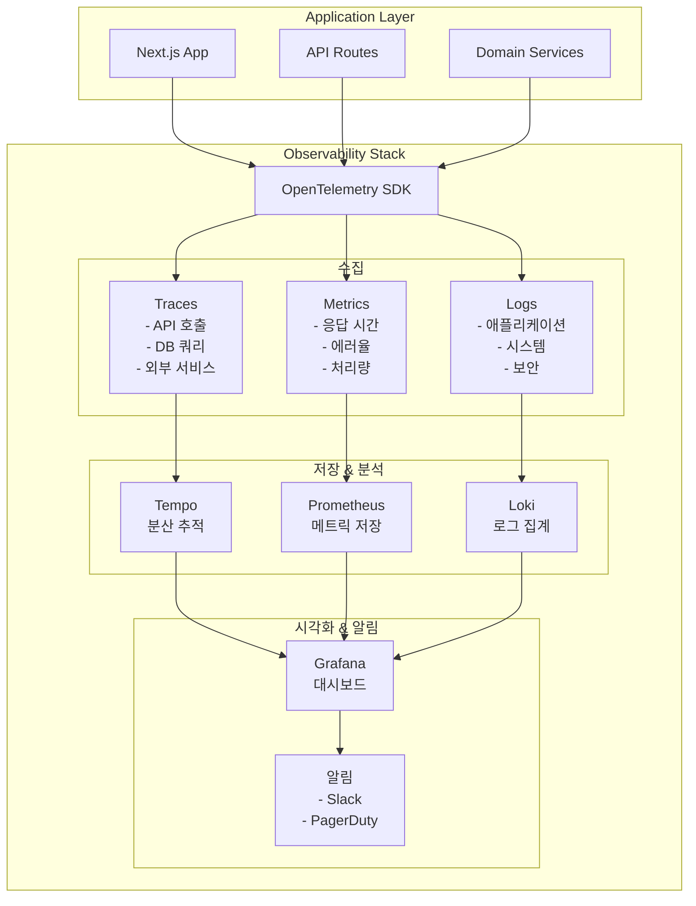
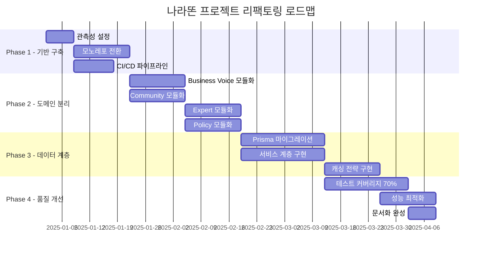

# 나라똔 프로젝트 아키텍처 비교 분석

## 1. 현재 아키텍처 (AS-IS)

## 2. 개선된 아키텍처 (TO-BE)

## 3. 도메인 경계 재설계

## 4. 데이터 플로우 개선

## 5. 배포 파이프라인 개선

## 6. 모니터링 체계 구축

## 7. 리팩토링 로드맵

## 구현 우선순위

1. **즉시 시작 가능** (Week 1-2)
   - OpenTelemetry 설정 및 기본 모니터링
   - 백업 폴더/레거시 코드 정리
   - ADR 템플릿 작성 시작

2. **단기 목표** (Week 3-6)
   - Turborepo 모노레포 구조 전환
   - 도메인별 서비스 계층 분리 시작
   - Playwright E2E 테스트 기본 설정

3. **중기 목표** (Week 7-12)
   - Prisma 마이그레이션
   - 관리자 앱 분리
   - 캐싱 전략 구현

4. **장기 목표** (3개월+)
   - 전체 테스트 커버리지 70% 달성
   - 완전한 타입 세이프티
   - 성능 최적화 (LCP < 2.5s)