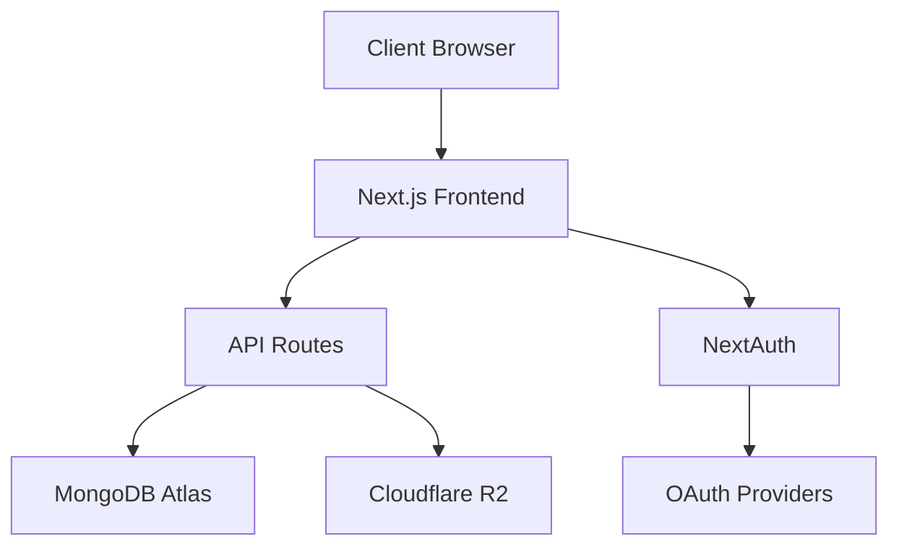
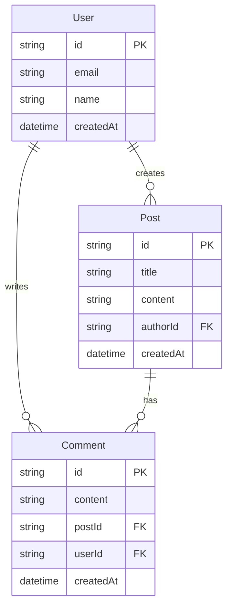
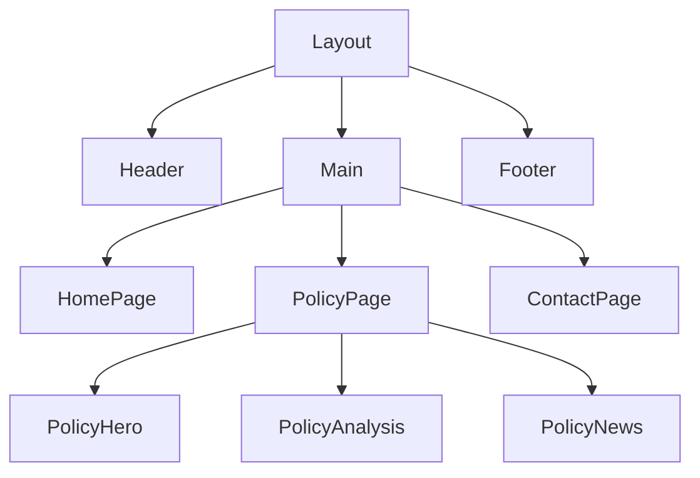
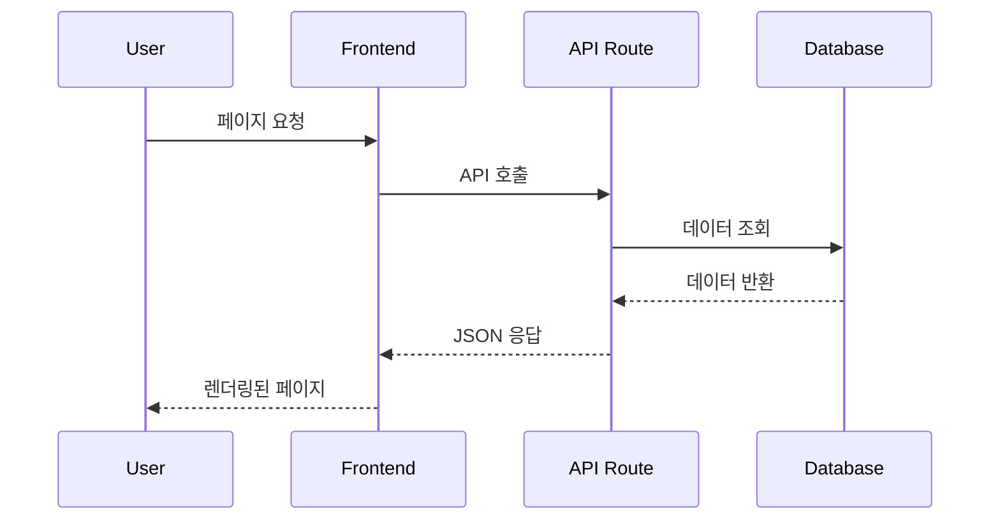

# 시스템 아키텍처 문서

## 프로젝트 구조

```mermaid
graph TD
    A[Client Browser] --> B[Next.js Frontend]
    B --> C[API Routes]
    C --> D[MongoDB Atlas]
    C --> E[Cloudflare R2]
    B --> F[NextAuth]
    F --> G[OAuth Providers]
```

## 데이터베이스 스키마

```mermaid
erDiagram
    User ||--o{ Post : creates
    User ||--o{ Comment : writes
    Post ||--o{ Comment : has

    User {
        string id PK
        string email
        string name
        datetime createdAt
    }

    Post {
        string id PK
        string title
        string content
        string authorId FK
        datetime createdAt
    }

    Comment {
        string id PK
        string content
        string postId FK
        string userId FK
        datetime createdAt
    }
```

## 컴포넌트 계층 구조

```mermaid
graph TB
    Layout --> Header
    Layout --> Main
    Layout --> Footer

    Main --> HomePage
    Main --> PolicyPage
    Main --> ContactPage

    PolicyPage --> PolicyHero
    PolicyPage --> PolicyAnalysis
    PolicyPage --> PolicyNews
```

## API 플로우

```mermaid
sequenceDiagram
    participant U as User
    participant F as Frontend
    participant A as API Route
    participant D as Database

    U->>F: 페이지 요청
    F->>A: API 호출
    A->>D: 데이터 조회
    D-->>A: 데이터 반환
    A-->>F: JSON 응답
    F-->>U: 렌더링된 페이지
```