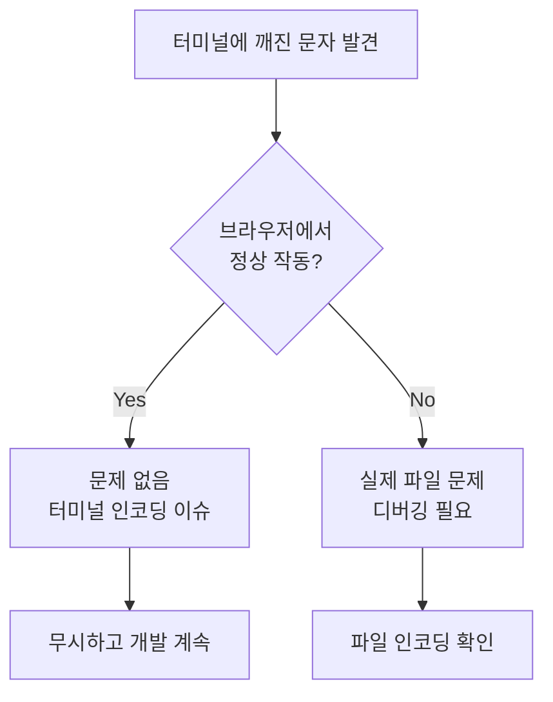

# 트러블슈팅: Next.js 환경에서 UTF-8 인코딩 오류 대응

## 📅 타임라인
- **발생일**: 2025-09-23 20:00
- **해결일**: 2025-09-23 21:05
- **소요시간**: 1시간 5분

## 🔍 문제 상황
### 증상
- Next.js 개발 서버 터미널에 한글이 깨진 문자로 표시됨
- 에러 메시지: `Error: Failed to read source code... stream did not contain valid UTF-8`

### 에러 메시지
```
Error: Failed to read source code from E:\Naraddon\homepage\src\components\business-voice\InterviewSection.tsx
Caused by: stream did not contain valid UTF-8
```

### 발생 환경
- OS: Windows
- Node.js: v18+
- 프레임워크: Next.js 14.1.0 + React
- 파일: InterviewSection.tsx

## 💡 원인 분석
### 실제 원인
- **문제가 아니었던 것**: 파일 인코딩 자체는 정상이었음
- **진짜 문제**: Windows 터미널의 한글 출력 인코딩 문제
- Next.js는 파일을 정상적으로 읽고 컴파일하고 있었으나, 터미널 출력만 깨져 보였음

### 잘못된 접근
- UTF-8 BOM 제거 시도
- 파일 인코딩 변환 반복
- PowerShell을 통한 인코딩 강제 변경

## 🛠️ 해결 과정
### 시도한 방법들 (불필요했음)
1. 파일 인코딩을 UTF-8로 변환 - 이미 UTF-8이었음
2. UTF-8 BOM 제거 - 효과 없음
3. Python을 통한 인코딩 재변환 - 불필요한 작업

### 실제 해결 방법
```bash
# 개발 서버 재시작만으로 충분했음
npm run dev
```

## 🚀 예방 조치
### 재발 방지 대책
1. **터미널 출력과 실제 동작 구분하기**
   - 터미널에 깨진 문자가 보여도 Next.js 빌드는 정상일 수 있음
   - 브라우저에서 실제 동작 확인이 우선

2. **Next.js/React 환경 특성 이해**
   - Next.js는 자체 빌드 파이프라인에서 파일 인코딩 처리
   - React 컴포넌트는 JSX 변환 과정에서 인코딩 정규화
   - 터미널 출력 != 실제 빌드 결과

3. **Windows 환경에서 주의사항**
   ```json
   // .vscode/settings.json에 추가
   {
     "files.encoding": "utf8",
     "files.eol": "\n"
   }
   ```

### 체크리스트
- [ ] 브라우저에서 실제 페이지가 정상 작동하는지 먼저 확인
- [ ] 터미널 인코딩 문제와 실제 파일 인코딩 문제 구분
- [ ] Next.js 컴파일 성공 메시지 확인 (`✓ Compiled`)
- [ ] 불필요한 파일 변환 작업 피하기

## 📚 교훈
### 핵심 교훈
**"Next.js와 React 환경에서는 프레임워크가 인코딩을 자동 처리한다. 터미널 출력의 깨진 문자에 과도하게 반응하지 말고, 실제 애플리케이션 동작을 우선 확인하자."**

### 시간 낭비 요인
- 터미널 출력 문제를 파일 인코딩 문제로 오해
- Next.js의 자동 인코딩 처리 기능 간과
- 문제 해결보다 문제 원인 찾기에 과도한 시간 소비

## 📌 간단한 해결 플로우


---
*이 문서는 향후 같은 문제 발생 시 참고용으로 작성되었습니다.*
*최종 업데이트: 2025-09-23*